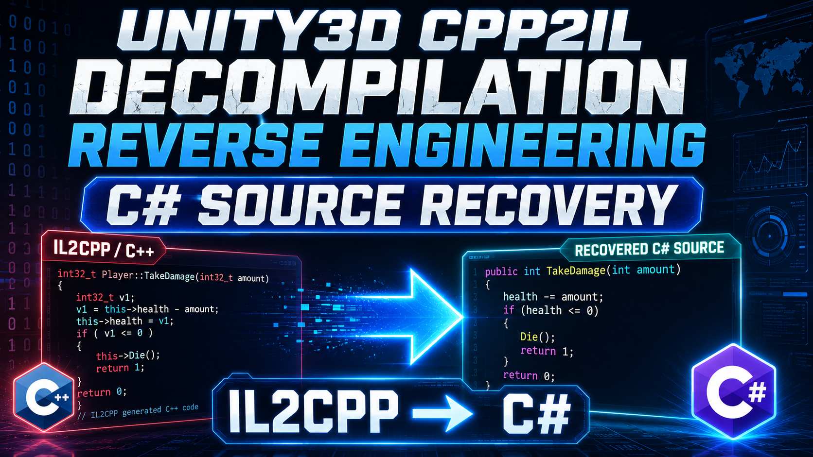

# cpp2il.github.io
Unity CPP2IL is a reverse-engineering platform for Unity IL2CPP. It processes APK, IPA, WASM, ELF, and Mach-O packages — extracting metadata, rebuilding type hierarchies, restoring call graphs and control flow, then decompiles to readable C# with a traceable IR pipeline. Designed for game security research, code auditing, and compatibility analysis

[English document](README.md) | [中文文档](README_zh.md) 

<h1 align="center">Unity CPP2IL</h1>

<p align="center">
  <strong>Multi-platform reverse engineering workbench for Unity IL2CPP</strong>
</p>

<p align="center">
  <a href="https://cpp2il.com">Official Website</a> ·
  <a href="https://ccna3po7lqul.feishu.cn/share/base/form/shrcnSKePcBYvea3LNF4h8wgvII">Apply for Beta</a> ·
  <a href="https://github.com/chenzifeng/cpp2il.github.io/issues">Issue Feedback</a> ·
  <a href="#-faq">FAQ</a>
</p>

<p align="center">
  
  
  
  
</p>

<a href="https://www.bilibili.com/video/BV1Rm7W6uEJM" target="_blank">
  
</a>

【Unity CPP2IL Product Introduction Video】
[https://www.bilibili.com/video/BV1Rm7W6uEJM](https://www.bilibili.com/video/BV1vm7W6gEjL)

【Unity CPP2IL Product Demo】
[https://www.bilibili.com/video/BV1Rm7W6uEJM](https://www.bilibili.com/video/BV1Rm7W6uEJM)


---

## Table of Contents

- [Introduction](#introduction)
- [Core Capabilities](#core-capabilities)
- [Supported Input Formats](#supported-input-formats)
- [Workflow](#workflow)
- [Output Results](#output-results)
- [Quick Start](#quick-start)
  - [Online Platform (Recommended)](#online-platform-recommended)
  - [Local Deployment](#local-deployment)
- [Usage Examples](#usage-examples)
  - [Example 1: Analyzing an Android APK](#example-1-analyzing-an-android-apk)
  - [Example 2: Analyzing an iOS IPA](#example-2-analyzing-an-ios-ipa)
  - [Example 3: Analyzing a WebGL WASM](#example-3-analyzing-a-webgl-wasm)
- [Project Structure](#project-structure)
- [Technical Architecture](#technical-architecture)
  - [Analysis Pipeline](#analysis-pipeline)
  - [AST Restoration Chain](#ast-restoration-chain)
- [Comparison with Similar Tools](#comparison-with-similar-tools)
- [Performance Benchmarks](#performance-benchmarks)
- [FAQ](#faq)
- [Security & Compliance](#security--compliance)
- [Contributing Guide](#contributing-guide)
- [Changelog](#changelog)
- [Contact](#contact)
- [License](#license)

---

## Introduction

**Unity CPP2IL** is a reverse analysis and C# code restoration platform for Unity IL2CPP projects.

The Unity engine uses IL2CPP (Intermediate Language To C++) technology to compile C# code into C++, which is then compiled into machine code by the platform's native compiler. This process loses original type information, generic parameters, delegate relationships, and high-level control flow structures. CPP2IL aims to recover as much of this information as possible from the compiled output, delivering readable and traceable C# code along with structured analysis reports.

### Use Cases

| Scenario | Description |
|---|---|
| **Game Security Research** | Analyze game logic, protocol communication, and data storage mechanisms |
| **Code Auditing** | Inspect third-party SDK behavior, privacy compliance, and sensitive data handling |
| **Compatibility Troubleshooting** | Locate the original code corresponding to IL2CPP symbols in crash stacks |
| **Vulnerability Analysis** | Reconstruct the context around potential security vulnerabilities |
| **Academic Research** | Compiler reverse engineering, program analysis, and static analysis research |

> **Disclaimer**: This tool is intended solely for security research and code auditing. Users must comply with local laws and regulations and shall not use it for illegal purposes.

---

## Core Capabilities

- **IL2CPP Metadata Parsing** — Parse `global-metadata.dat` to extract type definitions, method signatures, string literals, field layouts, and other metadata
- **libil2cpp Binary Analysis** — Identify IL2CPP-generated C++ functions and runtime interfaces based on ELF / PE / Mach-O / WASM binary structures
- **Type Structure Reconstruction** — Restore class inheritance hierarchies, interface implementations, generic instantiations, enum definitions, and nested types
- **Call Relationship Recovery** — Build method-level call graphs, identifying virtual method dispatch, delegate calls, and reflective invocations
- **Control Flow Analysis** — Recover if-else, loops, switch, try-catch, and other control flow structures from LLVM IR / machine code level
- **C# Code Restoration** — Output C# code that approximates typical Unity project conventions, preserving namespaces, type hierarchies, and method signatures
- **Traceable AST** — Every output code segment can be traced back to an intermediate representation (IR) node, facilitating manual review and verification
- **Multi-platform Coverage** — A unified analysis pipeline supports artifacts from Android, iOS, Windows, macOS, Linux, WebGL, and other platforms

---

## Supported Input Formats

| Format | Platform | Description |
|---|---|---|
| `.apk` | Android | Full APK package, automatically extracts and locates `libil2cpp.so` and `global-metadata.dat` |
| `.aab` | Android | Android App Bundle |
| `.ipa` | iOS | iOS application package, automatically extracts and locates the Mach-O binary |
| `.xarchive` / `.app` | macOS | macOS application bundle |
| `.exe` / `.dll` | Windows | Windows executable or IL2CPP dynamic library |
| `.so` / `.dylib` | Linux / macOS | ELF or Mach-O shared library |
| `.wasm` | WebGL | WebAssembly module, analyzed alongside JavaScript glue code |
| `libil2cpp.so` + `global-metadata.dat` | Generic | Directly upload the core binary and metadata files |

> No manual unpacking is required. The platform automatically identifies file type, target platform, and metadata structures.

---

## Workflow

```
┌──────────────┐     ┌──────────────┐     ┌──────────────┐     ┌──────────────┐
│              │     │              │     │              │     │              │
│ ① Upload     │───▶│ ② Auto-detect│───▶│ ③ Structure  │───▶│ ④ Export     │
│   Package    │     │              │     │   Restore    │     │   Results    │
│              │     │              │     │              │     │              │
└──────────────┘     └──────────────┘     └──────────────┘     └──────────────┘
  APK / IPA /          File type ID         Type rebuilding      C# code
  WASM / ELF /         Platform detection   Method signature     Structure report
  Mach-O / EXE         Metadata location    recovery             Analysis log
                       Decompilation         Call graph
                       strategy selection    construction
                                             Control flow analysis
                                             AST generation
```

### Detailed Steps

**Step 1 — Upload Package and Metadata**

Supports drag-and-drop or file selection. Both single-file (APK/IPA) and split-file (libil2cpp.so + global-metadata.dat) upload modes are supported.

**Step 2 — Automatic Target Identification**

- Detect file format (ELF / PE / Mach-O / WASM)
- Identify target architecture (ARMv7 / ARM64 / x86 / x86_64 / WebAssembly)
- Locate IL2CPP metadata sections and symbol tables
- Parse the Unity version to select the corresponding metadata structure definitions
- Choose the optimal analysis strategy based on platform characteristics

**Step 3 — Restore Structure and Call Relationships**

- Parse type definition tables, method definition tables, and string tables from `global-metadata.dat`
- Locate IL2CPP Runtime API call sites within the binary
- Rebuild class hierarchies (inheritance chains, interface implementations)
- Restore method signatures (parameter types, return values, generic parameters)
- Build method-level call graphs
- Recover high-level control flow from LLVM IR / machine code
- Generate an Abstract Syntax Tree (AST)

**Step 4 — View and Export Results**

- Browse the restored C# code online
- Navigate by namespace / type / method hierarchy
- View method-level call relationship diagrams
- Export the complete project structure (ZIP)
- Export analysis reports (Markdown / JSON)

---

## Output Results

### C# Code

The output C# code restores the following structures as accurately as possible:

```csharp
// Restoration example — output preserves namespaces, type hierarchies, generic parameters, and method signatures
namespace Game.Core
{
    public class PlayerController : MonoBehaviour
    {
        private Rigidbody _rigidbody;
        private float _moveSpeed = 5.0f;

        public void Move(Vector3 direction)
        {
            _rigidbody.velocity = direction * _moveSpeed;
        }

        private void Update()
        {
            float h = Input.GetAxis("Horizontal");
            float v = Input.GetAxis("Vertical");
            Move(new Vector3(h, 0f, v));
        }
    }
}
```

### Structured Report

```
├── types.json          # Type definitions (fields, methods, inheritance)
├── methods.json        # Method signatures and call relationships
├── strings.json        # String literal table
├── callgraph.json      # Method-level call graph
├── analysis.log        # Analysis process log
└── summary.md          # Human-readable summary report
```

### Traceable IR

Each restored C# statement can be linked to an intermediate representation node:

```
[Line 12] _rigidbody.velocity = direction * _moveSpeed;
  ├─ IR: StoreField(offset=0x28, type=Rigidbody)
  ├─ IR: BinaryOp(Mul, param_1, FieldLoad(offset=0x18))
  └─ Source: IL2CPP_icall UnityEngine_Rigidbody_set_velocity
```

---

## Quick Start

### Online Platform (Recommended)

1. Visit [cpp2il.com](https://cpp2il.com)
2. Click "Apply for Beta" to fill out the application form
3. After obtaining access, upload the package file
4. Wait for the analysis to complete, then browse or export results online

### Local Deployment

#### Requirements

| Dependency | Minimum Version | Notes |
|---|---|---|
| Docker | 24.0+ | Docker deployment is recommended |
| Disk Space | 10 GB+ | Depends on the size of the analysis target |
| Memory | 8 GB+ | 16 GB+ recommended for large packages |

#### Docker Deployment

```bash
# Pull the image
docker pull ghcr.io/your-org/cpp2il:latest

# Start the service
docker run -d \
  --name cpp2il \
  -p 8080:8080 \
  -v ./data:/app/data \
  ghcr.io/your-org/cpp2il:latest

# Access
open http://localhost:8080
```

#### Build from Source

```bash
# Clone the repository
git clone https://github.com/chenzifeng/cpp2il.github.io.git
cd cpp2il

# Install dependencies
npm install

# Build
npm run build

# Start
npm run start
```

---

## Usage Examples

### Example 1: Analyzing an Android APK

```bash
# Analyze an APK using the CLI tool
cpp2il analyze \
  --input game.apk \
  --platform android \
  --arch arm64 \
  --output ./output/

# Output structure
# ./output/
# ├── GameAssembly.so             # Extracted IL2CPP binary
# ├── global-metadata.dat         # Extracted metadata
# ├── decompiled/                 # Restored C# code
# │   ├── Assembly-CSharp/
# │   │   ├── Game/
# │   │   │   ├── Core/
# │   │   │   │   ├── PlayerController.cs
# │   │   │   │   ├── GameManager.cs
# │   │   │   │   └── ...
# │   │   │   └── UI/
# │   │   │       └── ...
# │   │   └── Plugins/
# │   └── Assembly-CSharp-firstpass/
# ├── report.json                 # Analysis report
# └── summary.md                  # Human-readable summary
```

### Example 2: Analyzing an iOS IPA

```bash
cpp2il analyze \
  --input game.ipa \
  --platform ios \
  --arch arm64 \
  --output ./output/

# The platform automatically:
# 1. Extracts IPA → Payload/Game.app/
# 2. Locates the main binary
# 3. Extracts embedded metadata
# 4. Executes the complete analysis pipeline
```

### Example 3: Analyzing a WebGL WASM

```bash
cpp2il analyze \
  --input build.wasm \
  --platform webgl \
  --glue build.framework.js \
  --output ./output/

# Additional processing for WebGL analysis:
# - WASM module parsing
# - JavaScript glue code mapping
# - IL2CPP WASM Runtime interface identification
```

---

## Project Structure

```
cpp2il/
├── packages/
│   ├── core/                  # Core analysis engine
│   │   ├── metadata/          # Metadata parser
│   │   │   ├── parser.ts      # global-metadata.dat parsing
│   │   │   ├── types.ts       # Type definition reconstruction
│   │   │   └── strings.ts     # String table extraction
│   │   ├── binary/            # Binary analysis
│   │   │   ├── elf.ts         # ELF format support
│   │   │   ├── pe.ts          # PE format support
│   │   │   ├── macho.ts       # Mach-O format support
│   │   │   └── wasm.ts        # WebAssembly support
│   │   ├── decompiler/        # Decompilation pipeline
│   │   │   ├── cfg.ts         # Control flow graph construction
│   │   │   ├── ssa.ts         # SSA transformation
│   │   │   ├── type-infer.ts  # Type inference
│   │   │   └── emitter.ts     # C# code generation
│   │   └── callgraph/         # Call graph analysis
│   ├── web/                   # Web frontend
│   │   ├── src/
│   │   │   ├── pages/         # Page components
│   │   │   ├── components/    # UI components
│   │   │   └── stores/        # State management
│   │   └── public/
│   ├── api/                   # Backend API
│   │   ├── routes/
│   │   ├── services/
│   │   └── workers/           # Analysis task queue
│   └── cli/                   # Command-line tool
├── docs/                      # Documentation
├── examples/                  # Example files
├── docker-compose.yml
└── README.md
```

---

## Technical Architecture

### Analysis Pipeline

```
                     ┌─────────────────────────────────────────────────┐
                     │              Unity CPP2IL Pipeline              │
                     └─────────────────────────────────────────────────┘
                                          │
                    ┌─────────────────────┼─────────────────────┐
                    ▼                     ▼                     ▼
            ┌──────────────┐     ┌──────────────┐     ┌──────────────┐
            │  Metadata    │     │  Binary      │     │  Glue /      │
            │  Parser      │     │  Analyzer    │     │  Runtime     │
            │              │     │              │     │              │
            │ global-      │     │ ELF/PE/MachO │     │ JS glue      │
            │ metadata.dat │     │ WASM module  │     │ IL2CPP RT    │
            └──────┬───────┘     └──────┬───────┘     └──────┬───────┘
                   │                     │                     │
                   └──────────┬──────────┘─────────────────────┘
                              ▼
                    ┌──────────────────┐
                    │  Type System     │
                    │  Reconstruction  │
                    │                  │
                    │ Class Inheritance│
                    │ / Interfaces     │
                    │ Generic Inst.    │
                    │ Enums / Delegates│
                    └────────┬─────────┘
                              │
                   ┌──────────┴──────────┐
                   ▼                     ▼
           ┌──────────────┐     ┌──────────────┐
           │  Call Graph  │     │  Control Flow│
           │  Builder     │     │  Recovery    │
           │              │     │              │
           │ Direct Calls │     │ if/else      │
           │ Virtual Disp.│     │ loops        │
           │ Delegates /  │     │ switch       │
           │ Reflection   │     │ try/catch    │
           └──────┬───────┘     └──────┬───────┘
                   │                     │
                   └──────────┬──────────┘
                              ▼
                    ┌──────────────────┐
                    │  AST Generation  │
                    │  & IR Tracing    │
                    └────────┬─────────┘
                              │
                   ┌──────────┴──────────┐
                   ▼                     ▼
           ┌──────────────┐     ┌──────────────┐
           │  C# Emitter  │     │  Report      │
           │              │     │  Generator   │
           │ Readable C#  │     │              │
           │ Organized by │     │ JSON / MD    │
           │ Namespace    │     │              │
           └──────────────┘     └──────────────┘
```

### AST Restoration Chain

Every output code segment can be traced back to its intermediate representation:

```
Source (C#) → IL (IL2CPP) → C++ (Compiled) → Machine Code → [CPP2IL] → IR → AST → C# (Restored)
```

CPP2IL's core task is to reverse-engineer the information from the right back to the left. The AST restoration chain ensures that every output node can be traced back to its corresponding IR representation, supporting manual review and verification.

---

## Comparison with Similar Tools

| Feature | CPP2IL | Il2CppDumper | Cpp2IL (Samboy) | dnSpy/ILSpy |
|---|:---:|:---:|:---:|:---:|
| Metadata Parsing | ✅ | ✅ | ✅ | ❌ |
| Method Body Restoration | ✅ | ❌ | ⚠️ Partial | ✅ (.NET only) |
| Control Flow Recovery | ✅ | ❌ | ⚠️ Basic | ✅ |
| Call Graph Construction | ✅ | ❌ | ❌ | ❌ |
| Traceable AST | ✅ | ❌ | ❌ | ❌ |
| WebGL Support | ✅ | ❌ | ❌ | ❌ |
| Online Platform | ✅ | ❌ | ❌ | ❌ |
| Unified Multi-format Input | ✅ | ❌ | ⚠️ | ❌ |
| Code Structure Restoration Quality | High | No code output | Medium | Managed code only |

> **Note**: This comparison is based on publicly available information as of May 2025. All tools are continuously updated; please refer to the latest versions for their actual capabilities.

---

## Performance Benchmarks

The following data is based on testing with typical Unity IL2CPP projects (for reference only):

| Metric | Small Project | Medium Project | Large Project |
|---|---|---|---|
| Method Count | ~5K | ~50K | ~200K+ |
| Metadata Size | ~5 MB | ~50 MB | ~200 MB+ |
| libil2cpp Size | ~30 MB | ~150 MB | ~500 MB+ |
| Analysis Time | ~2 min | ~15 min | ~60 min+ |
| Memory Usage | ~2 GB | ~6 GB | ~16 GB+ |

> Actual performance depends on server configuration, target complexity, and the IL2CPP version.

---

## FAQ

### Q: Which Unity versions are supported?

We support IL2CPP output from Unity 5.6 through Unity 6 (2025). The structure of `global-metadata.dat` differs across versions; the platform automatically detects and adapts to them.

### Q: Can the output C# code be compiled directly?

Not entirely. The output code restores type structures, method signatures, and control flow, but the following information may be missing or approximate:
- Local variable names (IL2CPP does not retain original variable names)
- Comments and code style
- Certain complex generic constraints
- Compiler-generated helper methods

The primary value of the output code lies in **readability analysis** and **structural understanding**, rather than direct recompilation.

### Q: How accurate are the analysis results?

Accuracy depends on target complexity and the IL2CPP version. Typically:
- **Types and Method Signatures**: >95% accuracy
- **Control Flow Structures**: >90% for simple functions; complex nested or optimized functions may require manual correction
- **Call Relationships**: High accuracy for direct calls; virtual methods and reflective calls may involve approximations

### Q: How is code obfuscation handled?

The platform includes basic anti-obfuscation capabilities (string decryption, control flow flattening recovery, etc.). For heavily obfuscated targets, it is recommended to leverage the IR tracing feature for manual analysis.

### Q: Where is the analysis data stored?

- **Online Platform**: Analysis results are encrypted at rest, retained for 30 days before automatic deletion. Users can manually delete them at any time.
- **Local Deployment**: Data is stored entirely on-premises and is never uploaded to external servers.

### Q: Can I analyze multiple packages in batch?

Batch queuing is not supported during the beta phase. The official release will include a batch analysis API and task queue functionality.

---

## Security & Compliance

### Data Security

- All uploaded files are transmitted using TLS encryption
- Analysis results are encrypted at rest with isolated access
- Manual deletion and automatic expiration are supported
- In local deployment mode, data never leaves the local network

### Compliance Statement

- This tool is intended solely for security researchers and code auditors
- Users must ensure they have legal permission to analyze the target
- The tool must not be used for intellectual property infringement, cracking commercial software, or other illegal activities
- Output results are for research reference only and do not constitute legal advice

---

## Contributing Guide

Community contributions are welcome. At this stage, we primarily accept the following types of contributions:

1. **Bug Reports** — Submit via [Issues](https://github.com/chenzifeng/cpp2il.github.io/issues)
2. **Documentation Improvements** — Corrections, clarifications, and translations
3. **Platform Adaptations** — Support for new file formats or Unity versions
4. **Analysis Strategies** — Improvements to control flow recovery, type inference, and other algorithms

### Development Workflow

```bash
# Fork this repository
# Create a feature branch
git checkout -b feature/your-feature

# Commit your changes
git commit -m "feat: add xxx support"

# Push and create a Pull Request
git push origin feature/your-feature
```

### Code Standards

- TypeScript strict mode
- ESLint + Prettier formatting
- Commit messages follow [Conventional Commits](https://www.conventionalcommits.org/)
- New features should include unit tests

---

## Changelog

### v0.9.0-beta (January 2026)

- Initial beta release
- Support for APK / IPA / WASM / ELF / Mach-O formats
- Complete metadata parsing → type reconstruction → control flow analysis → C# code generation pipeline
- Online workbench Web UI
- Basic call graph construction and IR tracing

### Planned

- [ ] Public CLI tool release
- [ ] Batch analysis API
- [ ] Full Unity 6 compatibility
- [ ] Expanded anti-obfuscation strategies
- [ ] Plugin system (custom analysis strategies)
- [ ] VS Code extension (browse analysis results online)

---

## Contact

| Channel | Link |
|---|---|
| Official Website | [cpp2il.com](https://cpp2il.com) |
| Beta Access Application | [cpp2il.com/apply.html](https://ccna3po7lqul.feishu.cn/share/base/form/shrcnSKePcBYvea3LNF4h8wgvII) |
| GitHub | [https://github.com/chenzifeng/cpp2il.github.io](https://github.com/chenzifeng/cpp2il.github.io) |
| Issue Feedback | [GitHub Issues](https://github.com/chenzifeng/cpp2il.github.io/issues) |

---

## License

Copyright © 2026 CPP2IL. All rights reserved.

This project is proprietary software. Unauthorized copying, modification, or distribution is prohibited. See the [LICENSE](./LICENSE) file for details.

---

<p align="center">
  <sub>For security research and code auditing purposes only. Please comply with local laws and regulations.</sub>
</p>
